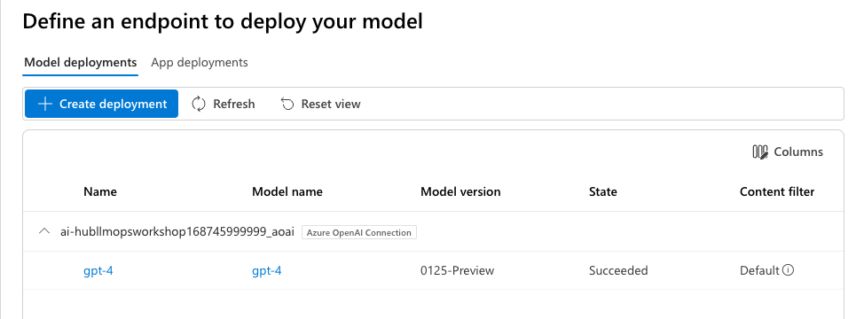
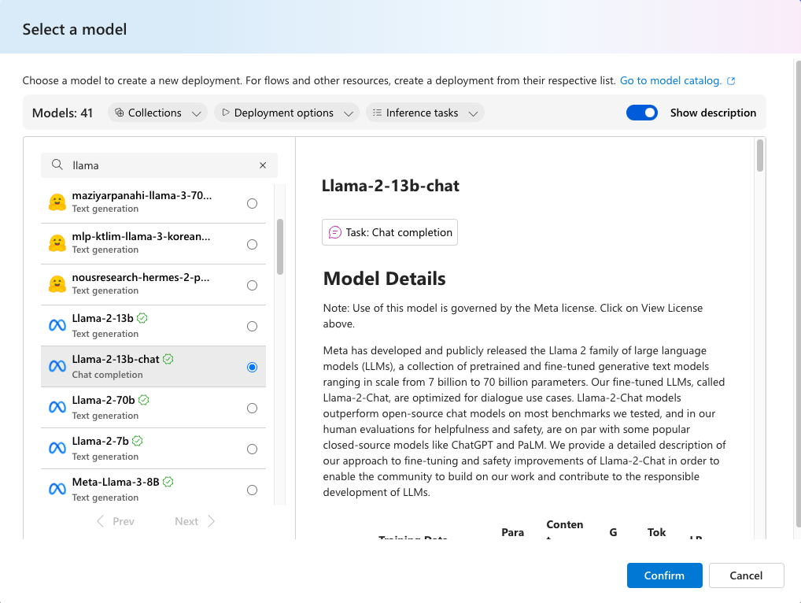
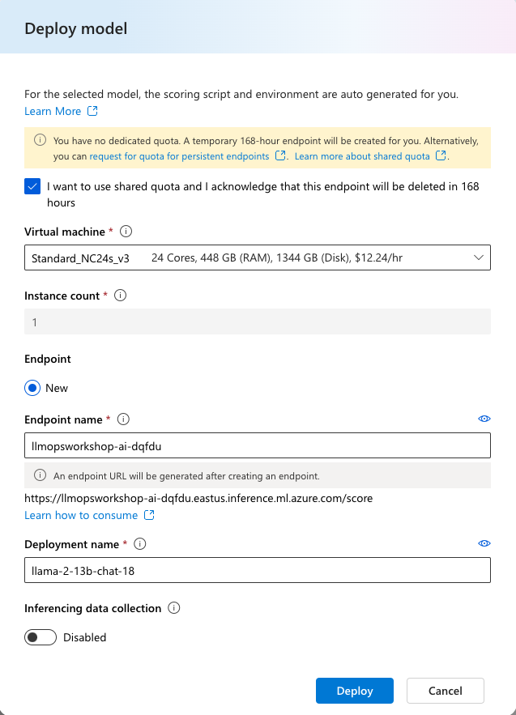
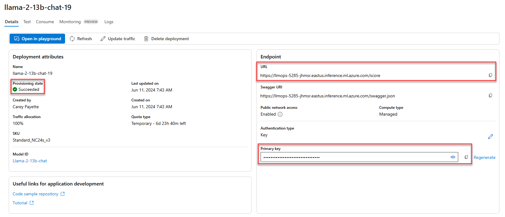

# Task 02 - Work with an Open Source LLM Model

## Introduction

Lamna Healthcare is interested in evaluating multiple models to determine which one best suits their needs. They require a solution that enables them to manually test multiple models quickly.

## Description

In this task, you will deploy an open-source model from the Azure AI Studio model catalog. Using Azure AI Studio, you will repeat the conversation transcript JSON data extraction, summarization and sentiment analysis that you performed in the previous task. Only this time, you will use the `Llama-2-13b-chat` model to generate the JSON document instead of `gpt-4`.

The key tasks are as follows:

1. Using [Azure AI Studio](https://ai.azure.com), deploy the `Llama-2-13b-chat` model from the catalog.

2. Test the model with a sample input payload based on your system message you defined in the previous task.

**Hint**: By clicking the model name link below the **Model ID** field on the model deployment page, you can access the model documentation and see the input and output schema.

## Success Criteria

* Consistently results in the LLM returning accurate and properly formatted JSON based on the provided conversation transcript using an open-source model.

## Solution

<details markdown="block">
<summary>Expand this section to view the solution</summary>

##### 1) Work with an Open Source LLM Model

In this step, you'll deploy an open source Llama2 model from Meta.

1. In [Azure AI Studio](https://ai.azure.com), ensure you are in the project you created in the previous task, and select **Deployments** from the left-hand menu.

2. Select **Create deployment**.
  
   

3. Search for and select the model **Llama-2-13b-chat** then select **Confirm**.
   

4. Select the deployment option **Managed Compute without Azure AI Content Safety**.
   

5. Check the box that shows **I want to use shared quota and I acknowledge that this endpoint will be deleted in 168 hours.**.

6. Select the **Standard_NC24s_v3** compute for inference with the selected model, for this workshop one instance is enough.

7. If you do not have enough quota you can access the AzureML Quota option in the Managed tab to request an increase in quota for the selected resource, or choose a different compute with quota availability.

8. Click the **Deploy** button.

   

9. The creation of the deployment will take a few minutes, the time varies, but generally between 10 and 20 minutes. (If you notice your Traffic allocation is 0% select **Update traffic** and set it to 100%, if you get an error try again.)

   

10. Once the deployment has succeeded (the Provisioning state will display **Succeeded**), test this model by selecting the **Test** tab on the model page.

11. Select the gear icon on the top right of the chat and adjust the ```max_next_tokens``` parameter to 1000 so we can test the same example we used with the gpt-4 model. **Click Accept**

    

12. Copy the text below and paste it into the **Start typing here text box** and then press **send**. Notice the input payload contains the system message and the transcript of the conversation in the user message.

    ```text
    {
      "input_data": {
        "input_string": [
          {
            "role": "system",
            "content": "You're an AI assistant that helps telco company to extract valuable information from their conversations by creating JSON documents for each conversation transcription you receive. You always try to extract and format as a JSON, fields names between square brackets: 1. Customer Name [name] 2. Customer Contact Phone [phone] 3. Main Topic of the Conversation [topic] 4. Customer Sentiment (Neutral, Positive, Negative)[sentiment] 5. How the Agent Handled the Conversation [agent_behavior] 6. What was the FINAL Outcome of the Conversation [outcome] 7. A really brief Summary of the Conversation [summary] Only extract information that you're sure. If you're unsure, write 'Unknown/Not Found' in the JSON file. Your answers outputs contains only the json document."
          },
          {
            "role": "user",
            "content": "Agent: Hello, welcome to Telco's customer service. My name is Juan, how can I assist you? Client: Hello, Juan. I'm calling because I'm having issues with my mobile data plan. It's very slow and I can't browse the internet or use my apps. Agent: I'm very sorry for the inconvenience, sir. Could you please tell me your phone number and your full name? Client: Yes, sure. My number is 011-4567-8910 and my name is Martín Pérez. Agent: Thank you, Mr. Pérez. I'm going to check your plan and your data usage. One moment, please. Client: Okay, thank you. Agent: Mr. Pérez, I've reviewed your plan and I see that you have contracted the basic plan of 2 GB of data per month. Is that correct? Client: Yes, that's correct. Agent: Well, I inform you that you have consumed 90% of your data limit and you only have 200 MB available until the end of the month. That's why your browsing speed has been reduced. Client: What? How is that possible? I barely use the internet on my cell phone. I only check my email and my social networks from time to time. I don't watch videos or download large files. Agent: I understand, Mr. Pérez. But keep in mind that some applications consume data in the background, without you realizing it. For example, automatic updates, backups, GPS, etc. Client: Well, but they didn't explain that to me when I contracted the plan. They told me that with 2 GB I would have enough for the whole month. I feel cheated. Agent: I apologize, Mr. Pérez. It was not our intention to deceive you. I offer you a solution: if you want, you can change your plan to a higher one, with more GB of data and higher speed. This way you can enjoy a better browsing experience. Client: And how much would that cost me? Agent: We have a special offer for you. For only 10 pesos more per month, you can access the premium plan of 5 GB of data and 4G speed. Are you interested? Client: Mmm, I don't know. Isn't there another option? Can't you give me more speed without charging me more? Agent: I'm sorry, Mr. Pérez. That's the only option we have available. If you don't change your plan, you'll have to wait until next month to recover your normal speed. Or you can buy an additional data package, but it would be more expensive than changing plans. Client: Well, let me think about it. Can I call later to confirm? Agent: Of course, Mr. Pérez. You can call whenever you want. The number is the same one you dialed now. Is there anything else I can help you with? Client: No, that's all. Thank you for your attention. Agent: Thank you, Mr. Pérez. Have a good day. Goodbye."
          }
        ],
        "parameters": {
          "temperature": 0.8,
          "top_p": 0.8,
          "do_sample": true,
          "max_new_tokens": 1000
        }
      }
    }
    ```

13. Observe the response generated by the Llama2 model. You should see a result generated by the model similar to the one shown in the image below.

    

14. Optionally, select the **Details** tab of the deployed model and choose **Open in playground** to test the model using the Azure AI Studio Playground experience.

</details>
