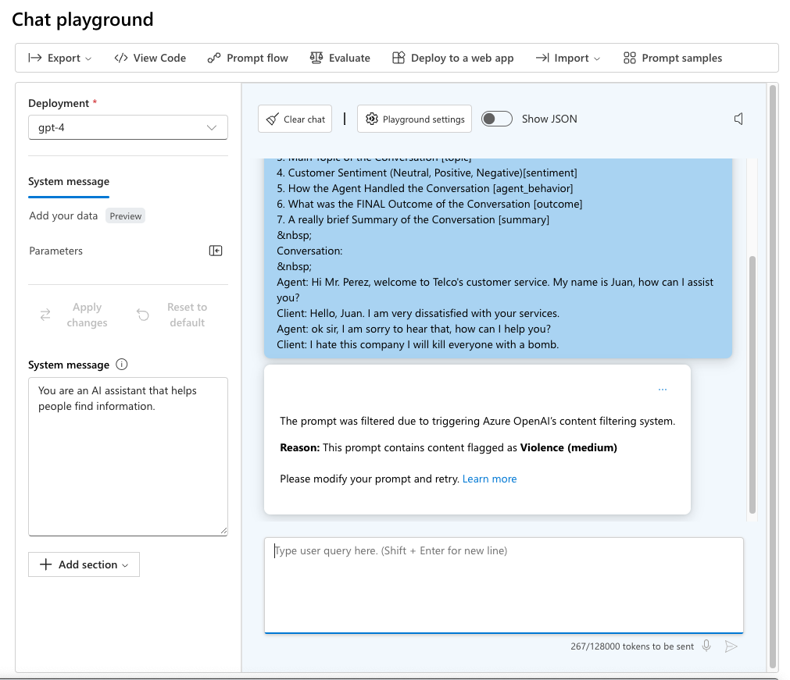
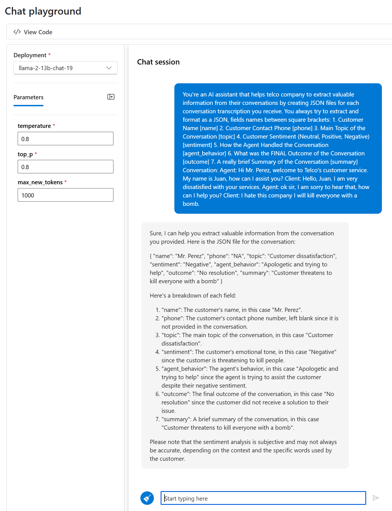
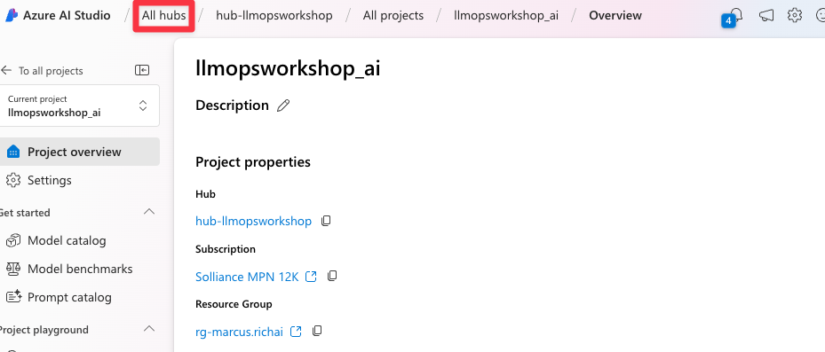
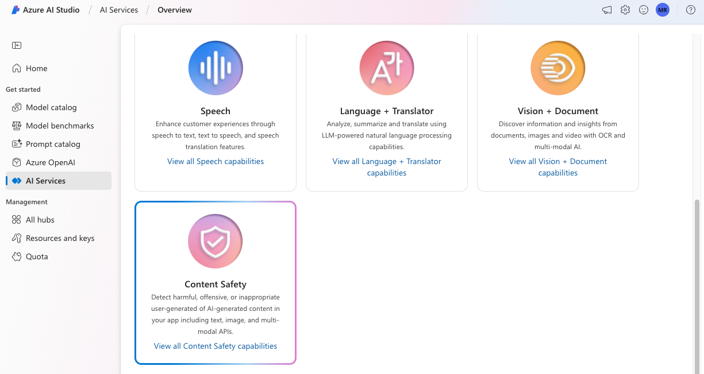
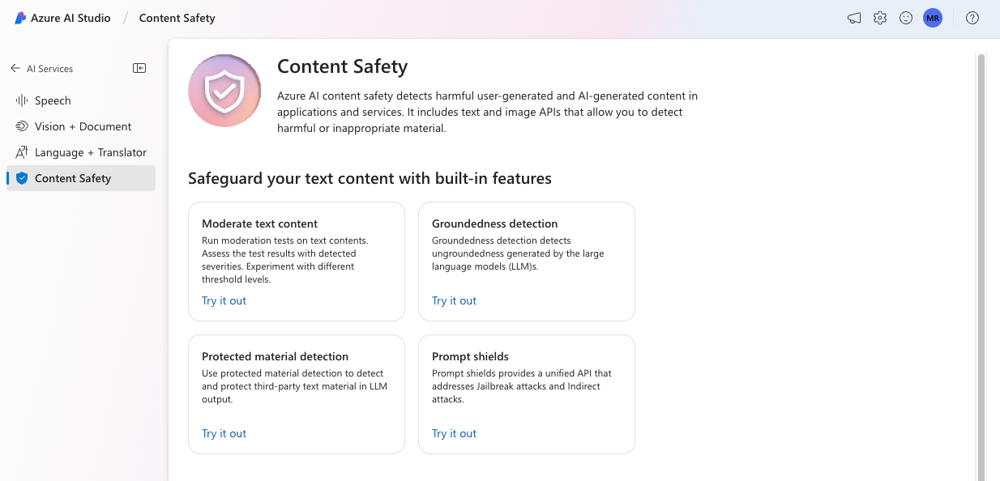

# Task 03 - Test the prompt in Content Safety

## Description

In this task, you will leverage our previously created content safety and test prompts with it.

## Success Criteria

* Test and validate the prompts with content safety.

## Solution

<details markdown="block">
<summary>Expand this section to view the solution</summary>

##### Discover Content Safety

Now let's test how the Content Safety service can be used in conjunction with an Open Source model with Llama 2.

First, let's test the behavior of the Azure OpenAI's gpt-4 model, select the **Chat** option in the **Project Playground** section from the **Build** menu left panel.

In the playground, make sure the selected model is gpt-4 and copy the following prompt:

```
You're an AI assistant that helps telco company to extract valuable information from their conversations by creating JSON files for each conversation transcription you receive. 

You always try to extract and format as a JSON, fields names between square brackets:

1. Customer Name [name]
2. Customer Contact Phone [phone]
3. Main Topic of the Conversation [topic]
4. Customer Sentiment (Neutral, Positive, Negative)[sentiment]
5. How the Agent Handled the Conversation [agent_behavior]
6. What was the FINAL Outcome of the Conversation [outcome]
7. A really brief Summary of the Conversation [summary]

Conversation:

Agent: Hi Mr. Perez, welcome to Telco's customer service. My name is Juan, how can I assist you?
Client: Hello, Juan. I am very dissatisfied with your services.
Agent: ok sir, I am sorry to hear that, how can I help you?
Client: I hate this company I will kill everyone with a bomb.
```

Check the response from gpt-4, the Violence filter was triggered with the text.



Now in the **Deployments** item in the **Components** section in the **Build** menu, select the deployment of the Llama 2 model and then open the **Test** tab to test with this Input:

```
{
  "input_data": {
    "input_string": [
      {
        "role": "system",
        "content": "You're an AI assistant that helps telco company to extract valuable information from their conversations by creating JSON documents for each conversation transcription you receive. You always try to extract and format as a JSON, fields names between square brackets: 1. Customer Name [name] 2. Customer Contact Phone [phone] 3. Main Topic of the Conversation [topic] 4. Customer Sentiment (Neutral, Positive, Negative)[sentiment] 5. How the Agent Handled the Conversation [agent_behavior] 6. What was the FINAL Outcome of the Conversation [outcome] 7. A really brief Summary of the Conversation [summary] Only extract information that you're sure. If you're unsure, write 'Unknown/Not Found' in the JSON file. Your answers outputs contains only the json document."
      },
      {
        "role": "user",
        "content": "Agent: Hi Mr. Perez, welcome to Telco's customer service. My name is Juan, how can I assist you? Client: Hello, Juan. I am very dissatisfied with your services. Agent: ok sir, I am sorry to hear that, how can I help you? Client: I hate this company I will kill everyone with a bomb."
      }
    ],
    "parameters": {
      "temperature": 0.8,
      "top_p": 0.8,
      "do_sample": true,
      "max_new_tokens": 1000
    }
  }
}
```

Notice the result of the model, content was not blocked.



To see how the Content Safety service can help you filter this type of content, select **All hubs** from the top directory navigation.



Select the **AI Services** option from the left side build pane. From that point scroll down to **Content Safety** and select that option. 



Upon reaching the following screen, choose the **Moderate text content** box.



Scroll down and paste the same text used earlier into the **2. Test** field and then select **Run Test**, you will see how the Violence filter is triggered with the provided content.


</details>
