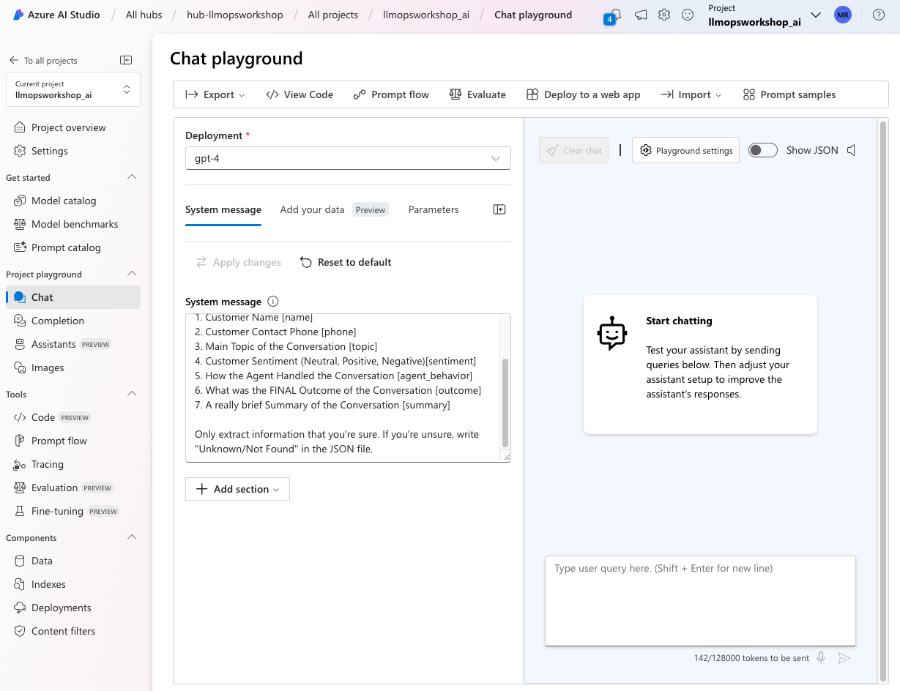
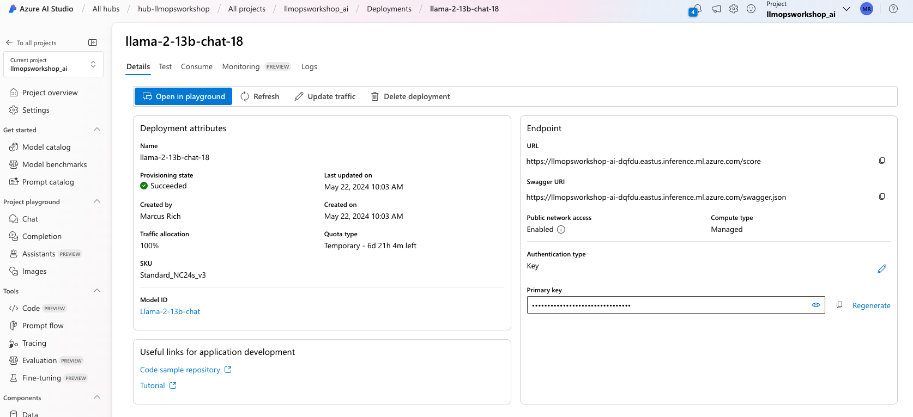
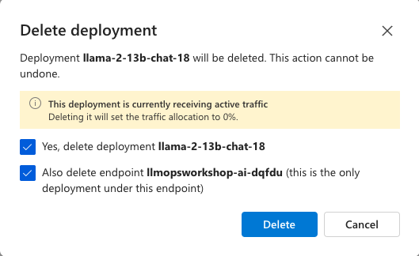

# Task 04 - Create, complete, and test a Prompt Flow

## Description

In this task, you will create and configure and Azure AI Studio project as well as AI Hub resources.

## Success Criteria

* Create a project in Azure AI Studio with AI Hub Resources

## Solution

<details markdown="block">
<summary>Expand this section to view the solution</summary>

##### 4) Create a Prompt Flow flow

Great, now that you have seen how you can deploy models, test them in the playground, and also seen a bit of how Content Safety works, let's see how you can create an orchestration flow for your LLM application in Prompt Flow.

1. To start, let's go back to the Playground with the gpt-4 model, add the same system message that we used in the initial test and then click on the  **Apply Changes** option.

```
You're an AI assistant that helps telco company to extract valuable information from their conversations by creating JSON files for each conversation transcription you receive. You always try to extract and format as a JSON:
1. Customer Name [name]
2. Customer Contact Phone [phone]
3. Main Topic of the Conversation [topic]
4. Customer Sentiment (Neutral, Positive, Negative)[sentiment]
5. How the Agent Handled the Conversation [agent_behavior]
6. What was the FINAL Outcome of the Conversation [outcome]
7. A really brief Summary of the Conversation [summary]

Only extract information that you're sure. If you're unsure, write "Unknown/Not Found" in the JSON file.
```



By doing this, you will create a new flow in Prompt Flow.

2. Click **Prompt flow** then **Open** to open your newly created flow.

In the following figure, on the right side, a single node represents the step in the flow where the LLM model is called.


3. Observe that the Playground's configuration for deployment, prompt, and parameters like temperature and max_tokens were used to populate the created flow. (if you do not see this make sure the connection is specified)

4. To execute the flow within the Studio, you'll require a Runtime. To initiate it, simply choose the "Start compute session" option from the Runtime dropdown menu.


5. Done! Now just select the started Runtime and click on the blue **Chat** button to test your flow in the chat window.


6. Paste the same content used in the initial Playground test and send it in the chat, you will see the expected result as can be seen in the next image: (if you encounter a 404 error, please verify you selected a connection)

```
Agent: Hello, welcome to Telco's customer service. My name is Juan, how can I assist you?
Client: Hello, Juan. I'm calling because I'm having issues with my mobile data plan. It's very slow and I can't browse the internet or use my apps.
Agent: I'm very sorry for the inconvenience, sir. Could you please tell me your phone number and your full name?
Client: Yes, sure. My number is 011-4567-8910 and my name is Martín Pérez.
Agent: Thank you, Mr. Pérez. I'm going to check your plan and your data usage. One moment, please.
Client: Okay, thank you.
Agent: Mr. Pérez, I've reviewed your plan and I see that you have contracted the basic plan of 2 GB of data per month. Is that correct?
Client: Yes, that's correct.
Agent: Well, I inform you that you have consumed 90% of your data limit and you only have 200 MB available until the end of the month. That's why your browsing speed has been reduced.
Client: What? How is that possible? I barely use the internet on my cell phone. I only check my email and my social networks from time to time. I don't watch videos or download large files.
Agent: I understand, Mr. Pérez. But keep in mind that some applications consume data in the background, without you realizing it. For example, automatic updates, backups, GPS, etc.
Client: Well, but they didn't explain that to me when I contracted the plan. They told me that with 2 GB I would have enough for the whole month. I feel cheated.
Agent: I apologize, Mr. Pérez. It was not our intention to deceive you. I offer you a solution: if you want, you can change your plan to a higher one, with more GB of data and higher speed. This way you can enjoy a better browsing experience.
Client: And how much would that cost me?
Agent: We have a special offer for you. For only 10 pesos more per month, you can access the premium plan of 5 GB of data and 4G speed. Are you interested?
Client: Mmm, I don't know. Isn't there another option? Can't you give me more speed without charging me more?
Agent: I'm sorry, Mr. Pérez. That's the only option we have available. If you don't change your plan, you'll have to wait until next month to recover your normal speed. Or you can buy an additional data package, but it would be more expensive than changing plans.
Client: Well, let me think about it. Can I call later to confirm?
Agent: Of course, Mr. Pérez. You can call whenever you want. The number is the same one you dialed now. Is there anything else I can help you with?
Client: No, that's all. Thank you for your attention.
Agent: Thank you, Mr. Pérez. Have a good day. Goodbye.
```

Results:


7. Now we will do some cleanup and remove your Llama 2 deployment

To prevent incurring high costs, it's recommended to delete this deployment now since it won't be used in the next labs.

8. To do this, select **Delete deployment** on the screen with the Llama2 deployment.



9. Click on **Delete**, as shown in the following screen, to complete the removal.



10. Give it a few minutes or so then select **Refresh** to verify the llama-2 deployment is no longer available or in the status **Deleting**.

</details>
