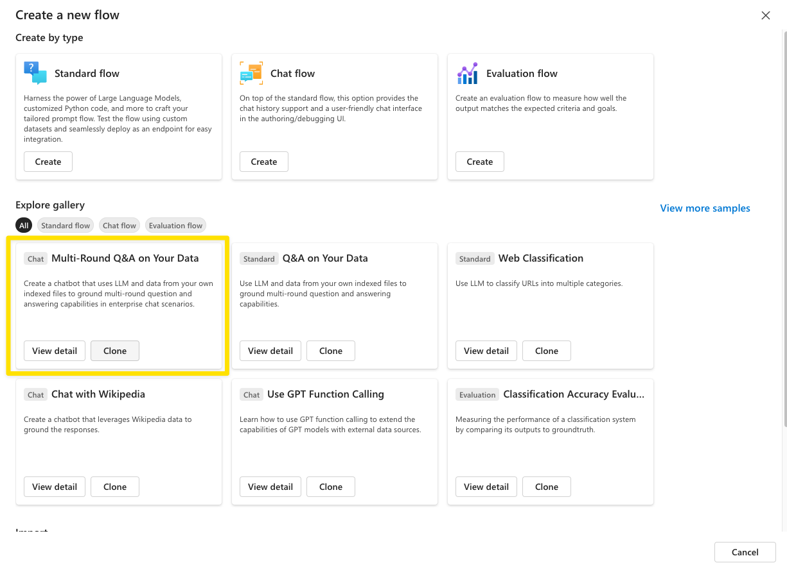
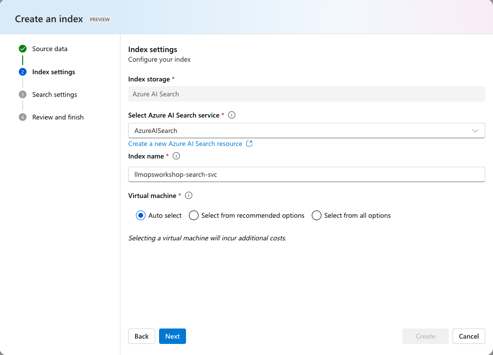
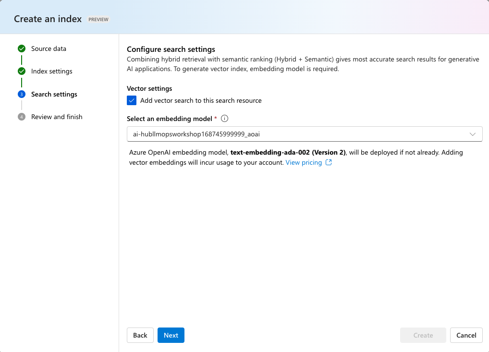
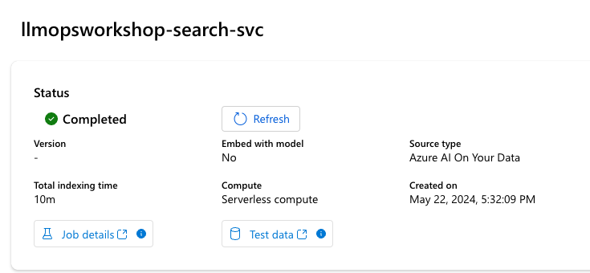
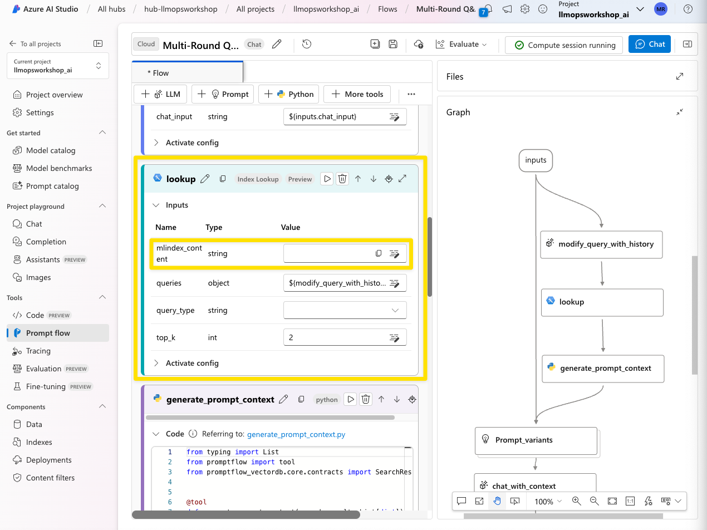
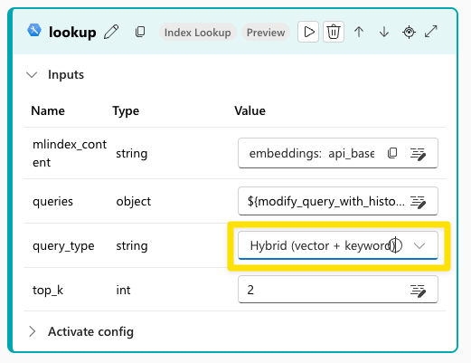
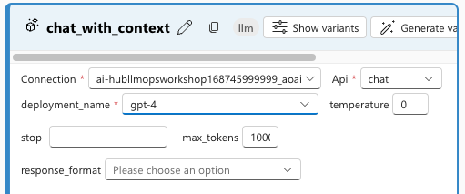

# Task 01 - Use AzureAI Studio Playground and create an AI Project and establish AI Hub resources

## Description

In this task, you will create and configure a Azure AI Studio project and define the system resources that will be used for the Hub.

## Success Criteria

* Create a project in Azure AI Studio with AI Hub Resources

## Solution

<details markdown="block">
<summary>Expand this section to view the solution</summary>

#####  Create an AI Project and AI Hub Resouces

Let's start by creating a project in Azure AI Studio.

Go to your browser and type: https://ai.azure.com

After logging in with your Azure account, you will see the following screen:



Select **+ New project** to create a project.

Choose an unique name for your project.


Select the **Create a new hub** link and choose a name for your AI hub where your project resources will be created.


> Note: Choose the region where the GPT-4 models and text-embeddings-ada-002 are available.

Still on this screen, select the **Create a new Azure AI Search** option; this service will be used in the following lessons.


Finally, select Create a project for the creation of the resources to be used in your project.


##### Deploy an Azure OpenAI model

After creating your AI Project, the first step is to create a deployment of an OpenAI model so you can start experimenting with the prompts you will use in your application.

To do this, select the **Deployments** option on the bottom of the project panel, and click on **Create deployment**.



From the list of models, select **gpt-4**.



On the next screen, define the name of the deployment, in this case, you can use the same name as the model and in the version field select the latest available version, in the example below we chose version **0125-Preview** (gpt4-turbo).



> Click on **Advanced Options** and select at least 40K **Tokens per Minute Rate Limit*** to ensure the flows run smoothly in the upcoming lessons.

Now, just click on **Deploy** and your model deployment is created. You can now test it in the Playground.

##### Create a Content Safety Service

By the end of this exercise, you will test with Content Safety. Therefore, click on the following link to create it [https://aka.ms/acs-create](https://aka.ms/acs-create). 

Select the resource group that you previously used for your AI Project. After that, follow the steps presented in the subsequent screens to continue with the creation process, start by clicking on **Review + create** button


Then click on **Create** to create your service.



Done! The Content Safety service is now created.


#### Exercise Steps

##### 1) Use AzureAI Studio Playground

On the screen with the deployment information, select the **Open in playground** button.



In this exercise, we will run an example where the model will help us summarize and extract information from a conversation between a customer and a representative of a telco company.

Copy the following prompt into the system message field of the playground:

```
You're an AI assistant that helps telco company to extract valuable information from their conversations by creating JSON files for each conversation transcription you receive. You always try to extract and format as a JSON:
1. Customer Name [name]
2. Customer Contact Phone [phone]
3. Main Topic of the Conversation [topic]
4. Customer Sentiment (Neutral, Positive, Negative)[sentiment]
5. How the Agent Handled the Conversation [agent_behavior]
6. What was the FINAL Outcome of the Conversation [outcome]
7. A really brief Summary of the Conversation [summary]

Only extract information that you're sure. If you're unsure, write "Unknown/Not Found" in the JSON file.
```

After copying, select **Apply changes**, (if prompted start a new chat)


Then type the following text in the chat session and click the send button:

```
Agent: Hello, welcome to Telco's customer service. My name is Juan, how can I assist you?
Client: Hello, Juan. I'm calling because I'm having issues with my mobile data plan. It's very slow and I can't browse the internet or use my apps.
Agent: I'm very sorry for the inconvenience, sir. Could you please tell me your phone number and your full name?
Client: Yes, sure. My number is 011-4567-8910 and my name is Martín Pérez.
Agent: Thank you, Mr. Pérez. I'm going to check your plan and your data usage. One moment, please.
Client: Okay, thank you.
Agent: Mr. Pérez, I've reviewed your plan and I see that you have contracted the basic plan of 2 GB of data per month. Is that correct?
Client: Yes, that's correct.
Agent: Well, I inform you that you have consumed 90% of your data limit and you only have 200 MB available until the end of the month. That's why your browsing speed has been reduced.
Client: What? How is that possible? I barely use the internet on my cell phone. I only check my email and my social networks from time to time. I don't watch videos or download large files.
Agent: I understand, Mr. Pérez. But keep in mind that some applications consume data in the background, without you realizing it. For example, automatic updates, backups, GPS, etc.
Client: Well, but they didn't explain that to me when I contracted the plan. They told me that with 2 GB I would have enough for the whole month. I feel cheated.
Agent: I apologize, Mr. Pérez. It was not our intention to deceive you. I offer you a solution: if you want, you can change your plan to a higher one, with more GB of data and higher speed. This way you can enjoy a better browsing experience.
Client: And how much would that cost me?
Agent: We have a special offer for you. For only 10 pesos more per month, you can access the premium plan of 5 GB of data and 4G speed. Are you interested?
Client: Mmm, I don't know. Isn't there another option? Can't you give me more speed without charging me more?
Agent: I'm sorry, Mr. Pérez. That's the only option we have available. If you don't change your plan, you'll have to wait until next month to recover your normal speed. Or you can buy an additional data package, but it would be more expensive than changing plans.
Client: Well, let me think about it. Can I call later to confirm?
Agent: Of course, Mr. Pérez. You can call whenever you want. The number is the same one you dialed now. Is there anything else I can help you with?
Client: No, that's all. Thank you for your attention.
Agent: Thank you, Mr. Pérez. Have a good day. Goodbye.
```



You will see a result generated by the model similar to the one shown in the image below.

Notice that the model correctly followed the instructions indicated in the System message field:


</details>
