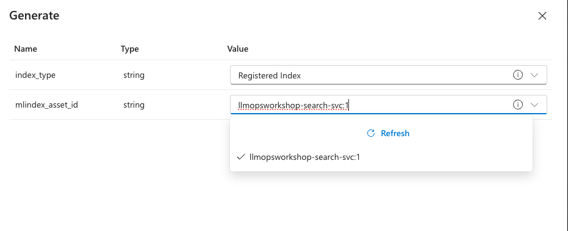
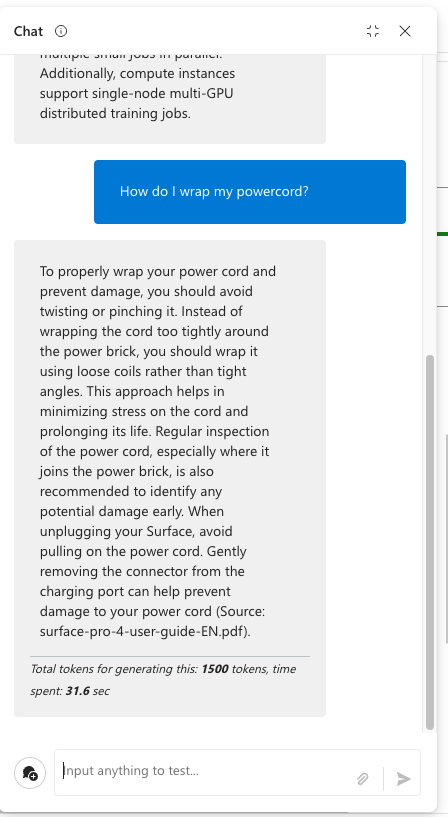

# Task 01 - Create a conversational RAG flow

## Introduction

Llamna Healthcare is interested in providing conversational assistants that provide answers to questions based on proprietary data that is not public. They have learned of the RAG (Retrieval-Augmented Generation) pattern, which is a powerful way to combine the strengths of retrieval and generation models. They would like to create a conversational RAG flow that can be used to answer questions from their customers using a no-code visual approach.

## Description

In this task, you will create a conversational RAG flow using Azure AI Studio. This flow will be used to answer questions from customers based on information located in a PDF document. Because the information in the PDF is specific and proprietary, you will also create and populate a vector index that will be used to search for textual references that are then passed on to the LLM as part of the RAG pattern.

Key steps include:

1. Create a conversational RAG flow.
2. Create and populate a vector index using the following pdf; [surface-pro-4-user-guide-EN.pdf](https://github.com/microsoft/llmops-workshop/blob/main/labs/lesson_02/files/surface-pro-4-user-guide-EN.pdf)
3. Configure the flow to use the vector index and proper model deployment connections.
4. Test and validate the flow in Azure AI Studio.

## Success Criteria

* The Prompt Flow correctly retrieves information from the vector index (that is populated with the PDF) and passes it on to the LLM. The LLM uses this information to respond with an appropriate answer to the user's question.

## Solution

Expand this section to view the solution

##### 1) Create a conversational RAG flow

1. In [Azure AI Studio](https://ai.azure.com), open the project you created in the first exercise, then select **Prompt flow** from the left-hand menu located beneath the **Tools** section.

2. On the **Flows** tab, select **+ Create** from the top toolbar.

3. In the **Create a new flow** dialog, beneath the **Explore gallery** heading, select the **Clone** button on the **Multi-Round Q&A on Your Data** item. When the **Clone flow** blade displays on the right, keep the default values and select **Clone**.

    

4. A new Multi-round Q&A flow is created. This flow enables the **RAG** or retrieval-augmented retrieval pattern.

    

5. Start the compute for the flow by selecting **Start compute session** button on the top taskbar menu.

    

6. Select the **Save** button located in the top taskbar menu to save your flow.

    

###### 2) Flow overview

The first node, `modify_query_with_history`, produces a search query using the user's question and their previous interactions. Next, in the `lookup` node, the flow uses the vector index to conduct a search within a vector store, which is where the RAG pattern retrieval step takes place. Following the search process, the `generate_prompt_context` node consolidates the results into a string. This string then serves as input for the `Prompt_variants` node, which formulates various prompts. Finally, these prompts are used to generate the user's answer in the `chat_with_context` node.

###### 3) Search index

Before you can start running your flow, a crucial step is to establish the search index for the Retrieval stage. This search index will be provided by the Azure AI Search service. The AI Search service was originally created in the **Setup** section of this exercise.

1. In our case, we will create a **Vector index**. To do this, you just need to go back to the project in the **AI Studio**, select the **Indexes** option, and then click on the **New index** button.  

2. Download file located here: [surface-pro-4-user-guide-EN.pdf](https://github.com/microsoft/llmops-workshop/blob/main/labs/lesson_02/files/surface-pro-4-user-guide-EN.pdf). This file will serve as the contents of the index.

3. At the `Source data` stage, select the `Upload files` option and upload the PDF file you downloaded in the previous step. Select **Next** to proceed.

    

4. In `Index settings` stage, select the search service that you created during the setup of exercise 1. Change the index name if desired to `llmopsworkshop-search-svc`. Keep the remaining settings as default and select **Next**.

    

5. Under `Search settings` stage, check the **Add vector search to this ...** checkbox, keep the default values for the remaining fields (the embedding model will be deployed to the current project AI Hub AI Services OpenAI instance) and select **Next**.

    

6. On the **Review and finish** stage, review the settings and select **Create**.  

7. The indexing job will be created and submitted for execution. It may take about 10 minutes for the indexing to complete. Wait until the index status indicates `Completed`, before proceeding with the next steps.  

    

8. On the left menu, beneath the **Components** heading, select the **Indexes** item. The vector index is shown in the index listing with a status of `Ready` indicating it's ready for use.

    

9. On the left menu, beneath the **Tools** heading, select the **Prompt flow** item. From the Prompt Flow list, select the `Multi-Round Q&A` flow that was created earlier. Verify that the compute session is running, if not start it by selecting the **Start compute session** button.

    

10. On the **Graph** pane, select the `lookup` node. This will surface the **lookup** node editor in the center of the screen.

11. In the `lookup` node editor,  select the `mlindex_content` **Value** textbox.

    

12. The **Generate** blade will appear. In this blade, select the `Registered Index` option for the `index_type` field. Then, choose the index that was just created. The value after the index name indicates the version number of the index. Select **Save**.

    

13. Returning to the `lookup` node editor. Select the `Hybrid (vector + keyword)` option from the `query_type` field. Selecting a hybrid search increases the quality of a search by leveraging both vector and keyword search methods.

    

###### 4) Updating connection information

1. In the **Graph** pane, select the `modify_query_with_history` node. Set the **Connection** drop down list value to the Azure OpenAI service that was deployed by the Azure AI Hub instance, then select the `gpt-4` option in the deployment drop down list.

    

2. In the **Graph** pane, select the `chat_with_context node` and set the same connection and deployment as in the previous step.

    

3. From the top taskbar, select **Save** to save the Prompt Flow.

###### 5) Testing your RAG flow

1. In the Prompt Flow editor, select the **Chat** button located in the top toolbar menu. When the **Chat** dialog displays, enter the text `How do I wrap my power cord?` in the chat textbox and press **Send**. Feel free to experiment with additional questions.

    

