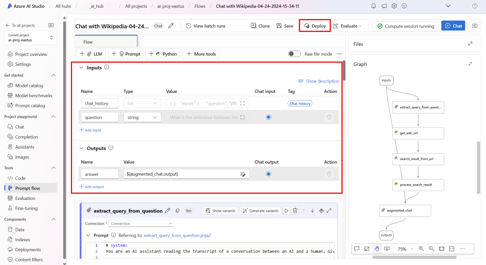
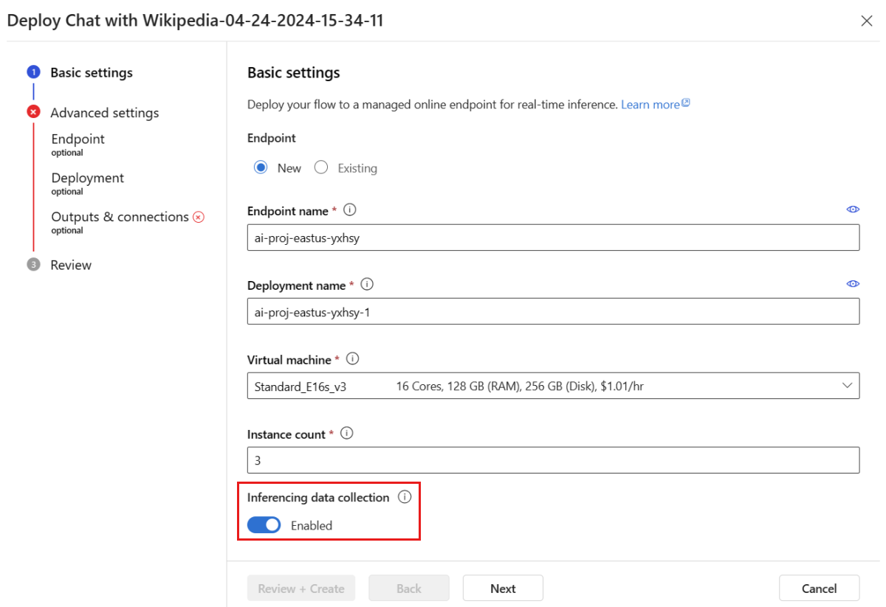
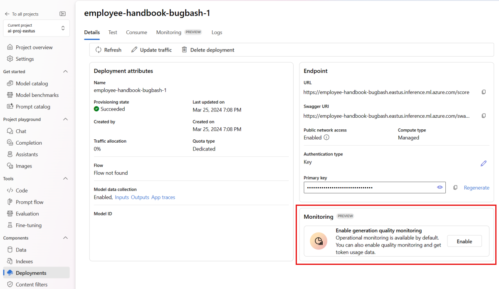
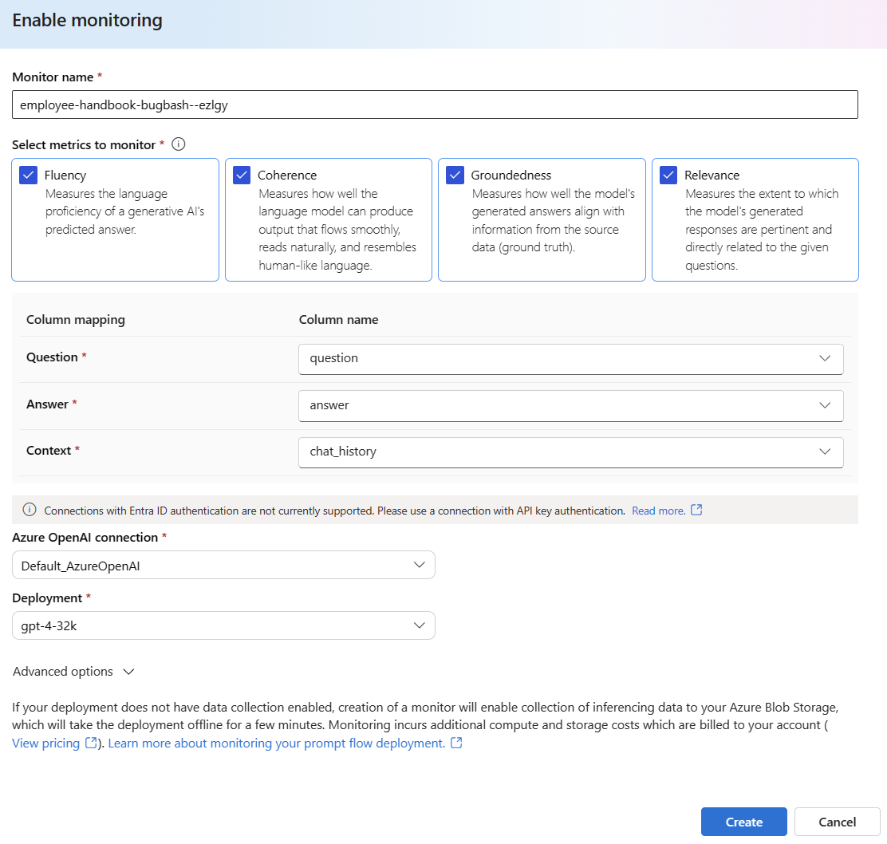
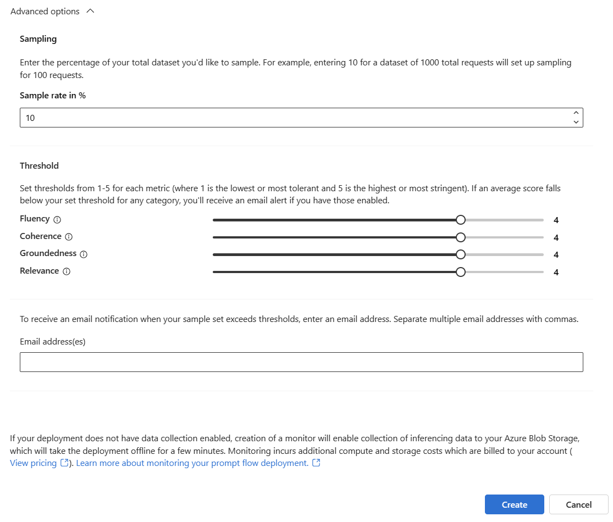
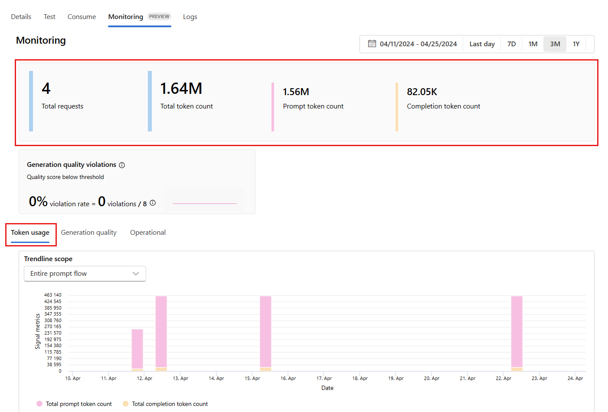
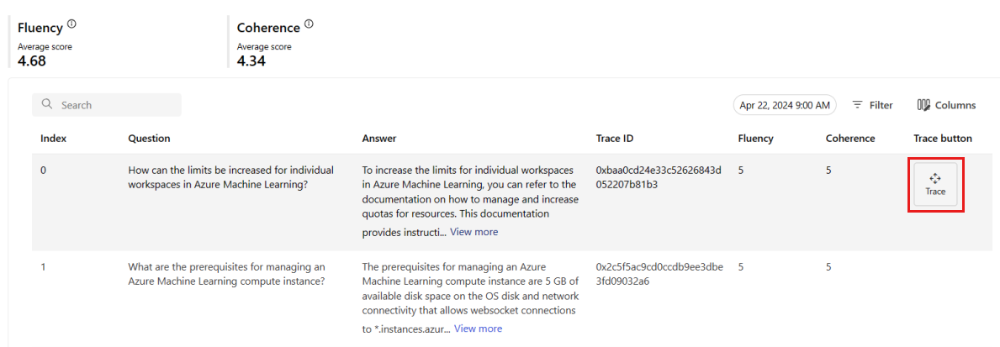
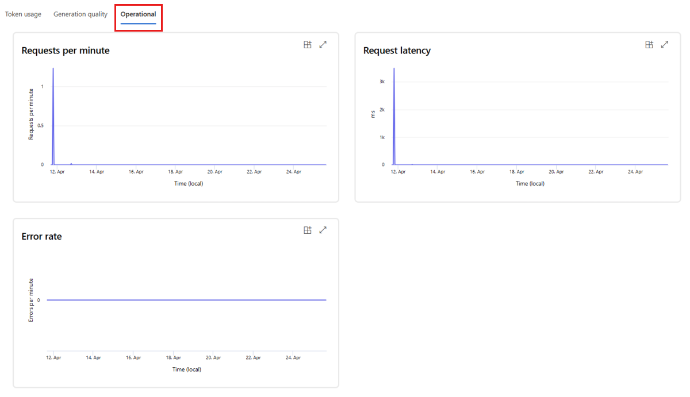

# Task 01 - Monitoring your Prompt Flows

## Description

In this task, you will create and configure a monitoring solution for the flows created in the previous exercises.

## Success Criteria

* Setup monitoring for Prompt Flow
* Configure monitoring
* Consume monitoring results

## Solution

Expand this section to view the solution

##### 1) Setup monitoring for prompt flow

Modify the output node of the workflow to incorporate the required information for computing the metrics that need monitoring, as outlined below.

Be sure to activate monitoring by selecting the "Enable" button within the Model Monitoring section when deploying the workflow. Then test the flows and see how the monitoring reacts and what information you can gather from that monitoring.

1. Sign in to Azure AI Studio.

2. Go to your Azure Studio Project.

3. From the left navigation bar, got to Tools > Prompt Flow.

4. Select the prompt flow that you created previously.

5. Confirm that your flow runs successfully and that the required inputs and outputs are configured for the metrics you want to assess. Supplying the minimum required parameters (question/inputs and answer/outputs) provides only two metrics: coherence and fluency. This example uses, question (Question) and chat_history (Context) as the flow inputs, and answer (Answer) as the flow output.

6. Select **Deploy** to begin deploying your flow.

7. In the deployment window, ensure that **Inferencing data collection** is enabled, which will seamlessly collect your application's inference data to Blob Storage. This data collection is required for monitoring.

8. Proceed through the steps in the deployment window to complete the **Advanced settings**.

9. On the "Review" page, review the deployment configuration and select **Create** to deploy your flow.

10. Select the **Test** tab on the deployment page, and test your deployment to ensure that it's working properly.

##### 2) Configure monitoring

The following steps are to be executed inside **Studio**.

1. From the left navigation bar, go to Components > Deployments.

2. Select the prompt flow deployment you just created.

3. Select Enable within the Enable generation quality monitoring box.

4. Begin to configure monitoring by selecting your desired metrics.

5. Confirm that your column names are mapped from you flow as defined below.

#### Column name mapping

When you create your flow, you need to ensure that your column names are mapped. The following input data column names are used to measure generation safety and quality: 

| Input column name | Definition | Required/Optional |
|------|------------|----------|
| Question | The original prompt given (also known as "inputs" or "question") | Required |
| Answer | The final completion from the API call that is returned (also known as "outputs" or "answer") | Required |
| Context | Any context data that is sent to the API call, together with original prompt. For example, if you hope to get search results only from certain certified information sources or website, you can define this context in the evaluation steps. | Required (only if Groundedness or Relevance is checked) |

6. Select the **Azure OpenAI Connection** and **Deployment** that you would like to use to perform monitoring for your prompt flow application.

7. Select **Advanced** options to see more options to configure.

8. Adjust the sampling rate, thresholds for your configured metrics, and specify the email addresses that should receive alerts when the average score for a given metric falls below the threshold.

9. Select **Create** to create your monitor.

##### 3) Consume monitoring results

After you've created your monitor, it will run daily to compute the token usage and generation quality metrics.

1. Go to the **Monitoring (preview)** tab from within the deployment to view the monitoring results. Here, you see an overview of monitoring results during the selected time window. You can use the date picker to change the time window of data you're monitoring. The following metrics are available in this overview:

    - **Total request count**: The total number of requests sent to the deployment during the selected time window.
    - **Total token count**: The total number of tokens used by the deployment during the selected time window.
    - **Prompt token count**: The number of prompt tokens used by the deployment during the selected time window.
    - **Completion token count**: The number of completion tokens used by the deployment during the selected time window.

2. View the metrics in the **Token usage** tab (this tab is selected by default). Here, you can view the token usage of your application over time. You can also view the distribution of prompt and completion tokens over time. You can change the **Trendline scope** to monitor all tokens in the entire application or token usage for a particular deployment (for example, gpt-4) used within your application. 

3. Go to the **Generation quality** tab to monitor the quality of your application over time. The following metrics are shown in the timechart:

    - **Violation count**: The violation count for a given metric (for example, Fluency) is the sum of violations over the selected time window. A *violation* occurs for a metric when the metrics are computed (default is daily) if the computed value for the metric falls below the set threshold value. 
    - **Average score**: The average score for a given metric (for example, Fluency) is the sum of the scores for all instances (or requests) divided by the number of instances (or requests) over the selected time window.

    The **Generation quality violations** card shows the **violation rate** over the selected time window. The **violation rate** is the number of violations divided by the total number of possible violations. You can adjust the thresholds for metrics in the settings. By default, metrics are computed daily; this frequency can also be adjusted in the settings.

4. From the **Monitoring (Preview)** tab, you can also view a comprehensive table of all sampled requests sent to the deployment during the selected time window. 

5. Select the **Trace** button on the right side of a row in the table to see tracing details for a given request. This view provides comprehensive trace details for the request to your application. 

6. Close the Trace view.
   
7. Go to the **Operational** tab to view the operational metrics for the deployment in near real-time. We support the following operational metrics:

    - Request count
    - Latency
    - Error rate

The results in the **Monitoring (preview)** tab of your deployment provide insights to help you proactively improve the performance of your prompt flow application. 

