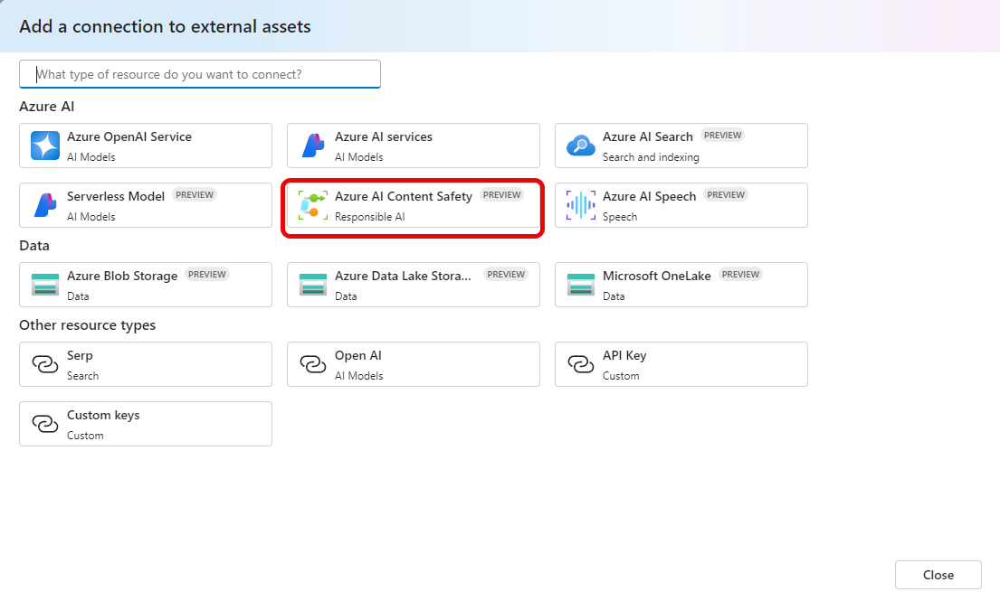
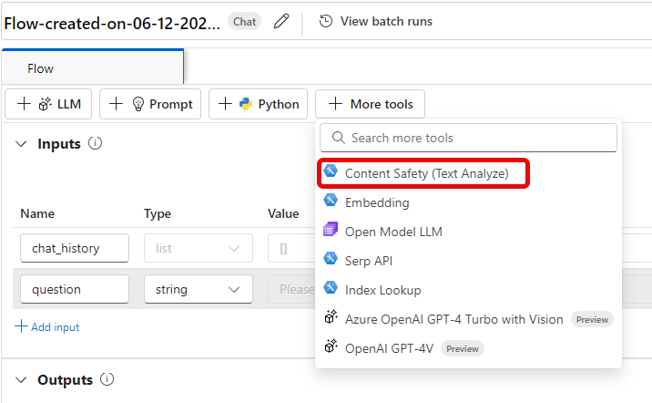
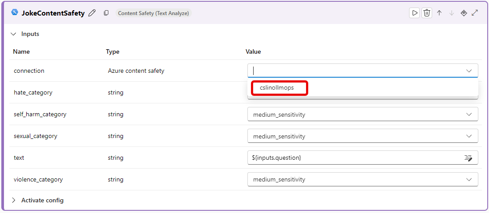
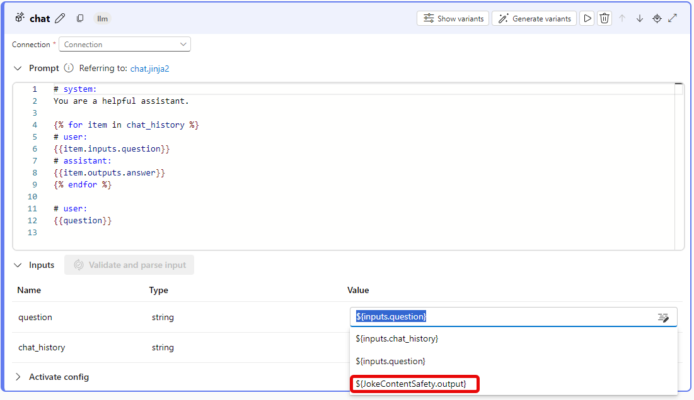

# Task 02 - Add Content Safety to your Solution with Python Code Processor

## Description

In this task, you will use the included reference instructions to insert a content safety tool and add a python node to gather and process that output.

## Success Criteria

* Successfully show content safety output and process

## References

* [Content Safety tool](https://learn.microsoft.com/en-us/azure/machine-learning/prompt-flow/tools-reference/content-safety-text-tool)
* [Conditional Flow in Prompt Flow](https://github.com/microsoft/promptflow/tree/main/examples/flows/standard/conditional-flow-for-if-else)

## Solution

Expand this section to view the solution

##### 1) Add Content Safety to your Solution

Create a basic **flow** from scratch (a simple Joke flow will be constructed).  
   
Make the following adjustments to the flow as per the instructions below:  
   
1. Insert a [Content Safety tool](https://learn.microsoft.com/en-us/azure/machine-learning/prompt-flow/tools-reference/content-safety-text-tool) node between the input and the language model (LLM). 
   1. We already created the Content Safety resource in the Azure Portal in the setup phase of Lab1
   2. Now it is time to create a connection to it in the Prompt Flow. On the left side click on **Settings**  and then click on **+ New connection** under **Connected resources**
   
   3. Add the connection to the `Azure AI Content Safety` resource
   
   4. Choose the resource you created earlier in Lab 1 for Content Safety and click **Add connection**, then close the dialog.
   
2. Go back to your flow and add the Content Safety node
   1. Click on `Start Compute session`
   2. Click on `More tools` and choose `Content Safety (Text Analyse)`
   
   3. enter the name `JokeContentSafety` and click add
   
   4. This is how the graph should look like at this time
   
   5. Connect the text property to the `{inputs.question}` node
   
   6. Connect the `connection` property to the `Azure AI Content Safety` connection name you created earlier.
   
   7. In the Chat flow, set the input of the question to the newly created `JokeContentSafety` node
   
   8. Set the connection of the `Chat` node to our Azure OpenAI Connection with the deployment name, temperature and max_tokens.
    
   9.  Now you can test the flow and see the output of the Content Safety tool
   

