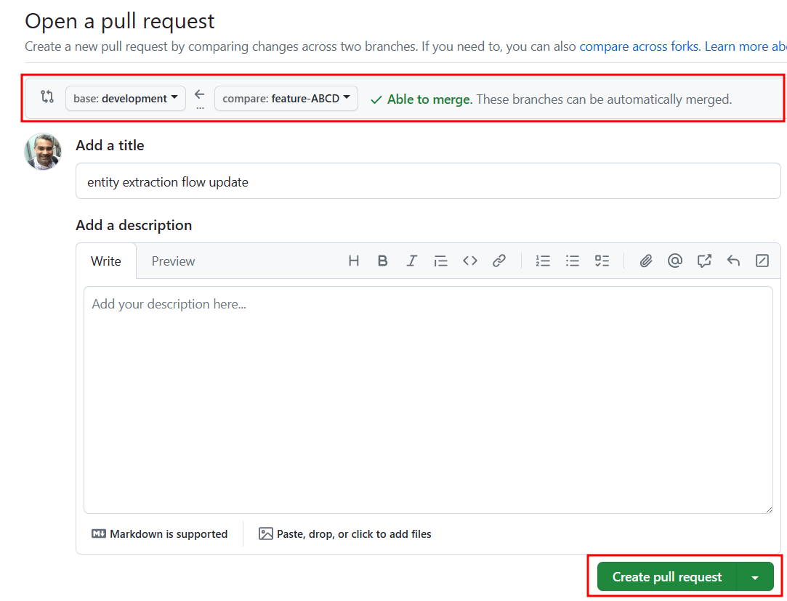
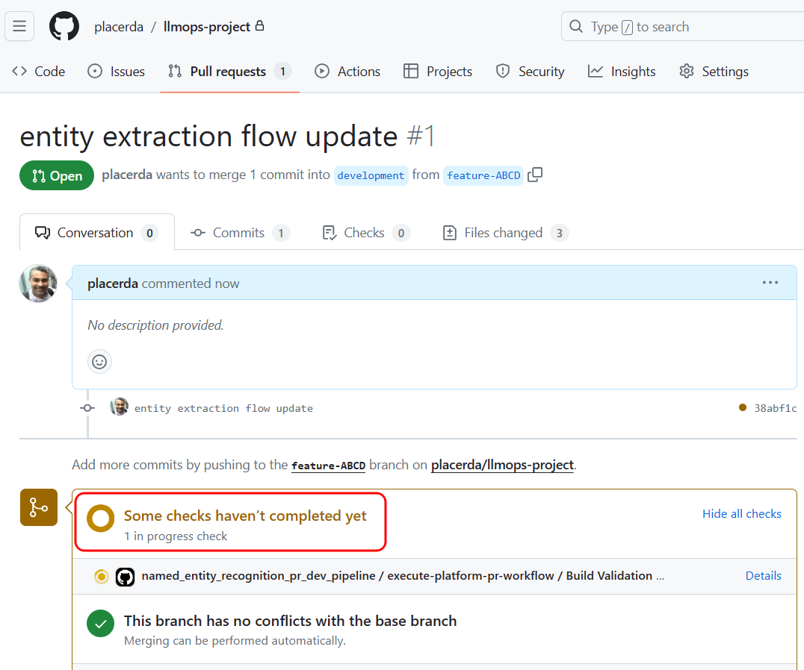
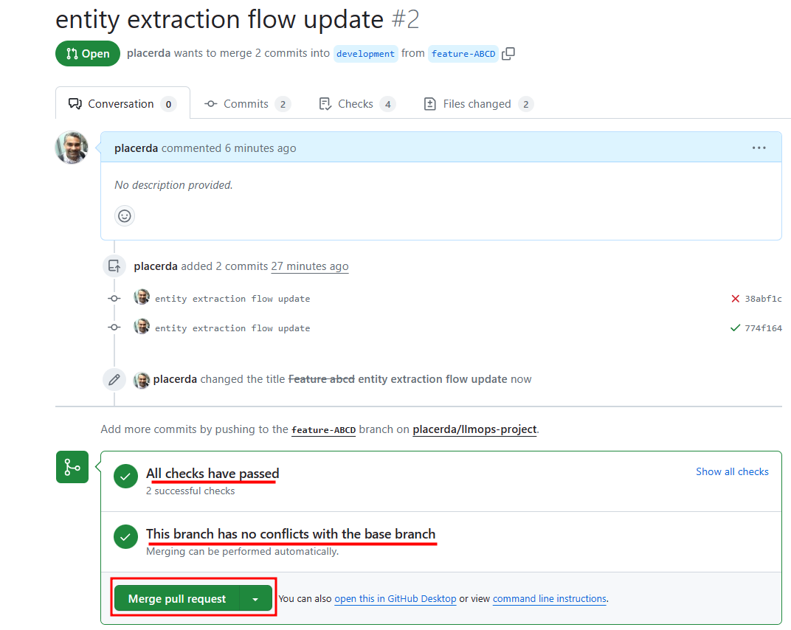
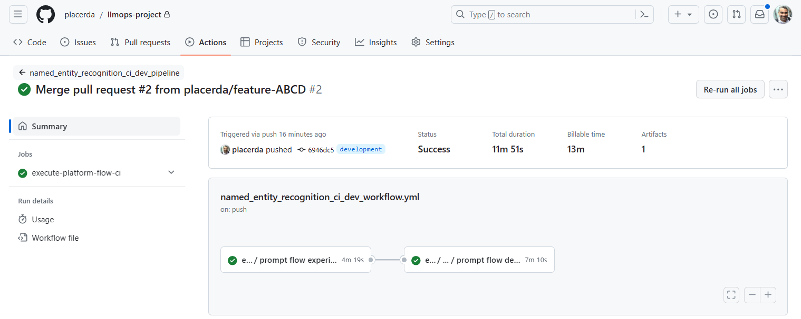

# Task 02 - Making and deploying a flow change

## Description

In this exercise, you already have your project configured and will make a change in the flow.

## Success Criteria

* Create a new feature branch.
* Change something in your flow.
* Update feature branch.
* Create a Pull Request from feature branch to development branch.
* Review and approve the PR for the new feature.
* Check CI pipeline execution.
* Check CD pipeline execution.

## References

* [LLMOps with Prompt Flow and GitHub](https://learn.microsoft.com/azure/machine-learning/prompt-flow/how-to-end-to-end-llmops-with-prompt-flow)
* [LLMOps with Prompt Flow template repo](https://github.com/microsoft/llmops-promptflow-template)
* [Basic LLMOps example](https://github.com/Azure/llmops-gha-demo/blob/main/docs/e2e_llmops_with_promptflow.md)

## Solution

<details markdown="block">
<summary>Expand this section to view the solution</summary>

##### 1) Create a new feature branch

1. In order to do that, run the following bash script.

    ```bash
    cd llmops-project
    
    echo "> Creating a feature branch"
    git checkout -b feature-ABCD
    
    echo "> Pushing the development branch to the remote repository"
    git push origin feature-ABCD
    ```

2. Change something in your flow.

    In this step, make a change in the `entity_extraction` flow, such as renaming one of the nodes.

3. Update feature branch.

    In order to update the feature branch, run the following bash script.

    ```bash
    cd llmops-project
    git add .
    git commit -m "updating config"
    git push origin feature-ABCD
    ```

4. Create a Pull Request from the feature branch to the development branch.

    Go to the project repository on GitHub.com to create the pull request.

    

    

    After creating the Pull Request, you will notice that the Pull Request flow has been initiated.

    

5. Review and approve the PR for the new feature.

    

6. Check CI pipeline execution.

    Check the execution of the CI pipeline in the GitHub actions option.

    

7. Check CD pipeline execution.

    Check the execution of the deployment pipeline in the GitHub actions option.

    

    Click on each of the pipelines to view the log and the artifacts with the results of the evaluations.

    Congratulations all exercises are now complete!

</details>
